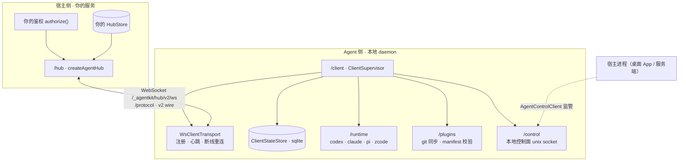

# allinai-agentkit

独立持久 **Agent Client**：连接 Hub，可靠执行本地平台 Agent（Codex / Claude / Pi，可选）与受策略门控的能力，并向上游回报状态。本仓库 = npm 包 `@allin-ai/agentkit` + CLI `allinai-agentkit` + 内置本地 demo 控制台（memory hub + 授权接入）。

官网（介绍与使用场景）：https://df007df.github.io/allinai-agentkit/ ，由 `site/` 目录经 GitHub Actions 自动发布。完整文档（安装 → CLI 参考 → 功能 → 系统集成 → 架构）：https://df007df.github.io/allinai-agentkit/docs.html

## 快速开始（npm）

要求 Node.js ≥ 22.18。包已发布到 npm，无需克隆仓库：

```bash
# 终端 A：启动 demo 控制台 + hub（默认 http://127.0.0.1:4317）
npx @allin-ai/agentkit demo

# 终端 B：浏览器授权接入，然后常驻接入
npx @allin-ai/agentkit login --hub http://127.0.0.1:4317
npx @allin-ai/agentkit daemon
```

## 快速开始（本地源码）

```bash
pnpm install && pnpm build

# 终端 A：启动 demo 控制台 + hub（默认 http://127.0.0.1:4317）
node bin/allinai-agentkit demo

# 终端 B：浏览器授权接入
node bin/allinai-agentkit login --hub http://127.0.0.1:4317

# 终端 B：常驻接入
node bin/allinai-agentkit daemon
```

打开 http://127.0.0.1:4317 ：控制台会出现你的 client，可派发任务并观察协议事件时间线。

授权模型：demo 启动不发放任何全局 token；client 凭自己 config 里的唯一 clientId 发起 `login`，浏览器授权页确认后，web 内存中登记 `token → clientId` 并以此放行后续连接（内存态，重启即清空，需重新 login）。

## 安装（一键 sh 脚本）

```bash
sh scripts/install.sh                 # npm 全局安装最新版
sh scripts/install.sh 0.3.2           # 指定版本
sh scripts/install.sh --from-source   # 本仓库构建 + npm link（开发）
```

脚本会检查 Node.js ≥ 22.18，安装后验证 `allinai-agentkit --help`。

## 架构与包结构



支撑模块（daemon 内部使用）：`/config` 工作目录与本地策略、`/credentials` token 存取（Keychain）、`/paths` 数据目录、`/logger` 滚动日志、`/service/*` 开机自启。开发与联调：`/hub/testkit` 内存 Hub，`/demo` 一键控制台。

| 入口 | 分组 | 内容 |
|---|---|---|
| `@allin-ai/agentkit` | 入口 | 公共 API 汇总（protocol / hub / client 核心、config、credentials、control、logger、paths；不含 runtime、testkit、demo） |
| `@allin-ai/agentkit/protocol` | 协议 | v2 wire 协议与全部编解码；`/wire` 为兼容别名 |
| `@allin-ai/agentkit/hub` | Hub 侧 | `createAgentHub({ authorize, store })`，HubStore 六方法端口，`offer()` 派发 |
| `@allin-ai/agentkit/hub/testkit` | Hub 侧 | `MemoryHubStore` / `createMemoryHub`，易失实现（勿用于生产） |
| `@allin-ai/agentkit/client` | Agent 侧 | `ClientSupervisor` + `WsClientTransport` + `ClientStateStore`（sqlite 落盘） |
| `@allin-ai/agentkit/runtime` | Agent 侧 | `createRunnerManager` 与 codex / claude / pi / zcode 适配（可选 peer） |
| `@allin-ai/agentkit/plugins` | Agent 侧 | `PluginManager`：plugin.sync → git 同步 + manifest 校验 |
| `@allin-ai/agentkit/control` | Agent 侧 | 本地控制面（unix socket）：health / status / approve / plugins |
| `@allin-ai/agentkit/config` | 设施 | clientId、本地策略、projects 工作目录（`~/.allinai/agent/config.json`） |
| `@allin-ai/agentkit/credentials` | 设施 | token 安全存取（macOS Keychain，服务名 allinai-agent） |
| `@allin-ai/agentkit/paths` | 设施 | 数据目录与 socket 端点解析 |
| `@allin-ai/agentkit/logger` | 设施 | 滚动 JSONL 日志，自动脱敏 |
| `@allin-ai/agentkit/service/launchd` | 设施 | macOS 用户级服务注册 |
| `@allin-ai/agentkit/service/systemd` | 设施 | Linux 用户级服务注册 |
| `@allin-ai/agentkit/cli` | 工具 | 全部 CLI 子命令实现（bin 的薄封装在其上） |
| `@allin-ai/agentkit/demo` | 工具 | `startDemoSite()`：本地控制台 + 内存 Hub + 浏览器授权 |

## CLI

```
allinai-agentkit <init|login|daemon|demo|install|status|logs|sync|restart|uninstall|doctor|projects|project|plugins>
allinai-agentkit project --name web --path /work/web    # 注册项目工作目录
allinai-agentkit project --name web --remove            # 移除
allinai-agentkit projects                               # 列出已注册项目
allinai-agentkit plugins [--refresh]                    # 查看已装插件；--refresh 重新上报 Hub
```

### 项目目录

项目在 client 本地 config.json 的 `projects` 中注册（`project add` 即写入）。Hub 下发的 `agent.run` 可携带 `payload.project`：

- 不带 `project`（或名字未注册）：使用各 runtime 的默认工作目录；
- 带 `project` 且已注册：在该目录中执行，同时把 `resolvedProjectPath` 附进执行上下文。

Hub 无法自选任意路径——只能从本地注册的目录里按名字挑选。

### 插件

- Hub 主动推送：`hub.syncPlugins({ principal, targetClientId, revision, plugins })`（demo 站点提供 `POST /_agentkit/demo/plugins/sync`）。
- client 收到后校验清单、克隆到不可变修订目录并原子激活，随后回 `plugin.sync.ack`（含每个插件的 resolvedCommit）。
- 本地随时查看：`allinai-agentkit plugins`；重新上报：`allinai-agentkit plugins --refresh`。

### 执行日志

daemon 把每条命令的接收、策略判定、runner 终态写入 `~/.allinai/agent/logs/agent.log`（滚动 JSONL，自动脱敏）。`allinai-agentkit logs [-f]` 查看并再次脱敏输出。

## 开发

```bash
pnpm typecheck && pnpm test && pnpm build && pnpm verify:artifact
```

## 发布

推送 `v*` 标签触发 `.github/workflows/release.yml`：测试 → 类型检查 → `verify:artifact` → 经 trusted publishing 发布到 npm（附 SLSA provenance，无需本地凭据）。

```bash
# 本例：发布 0.3.3
npm version patch          # 或手改 package.json 的 version
git push --follow-tags
```

MIT License.
