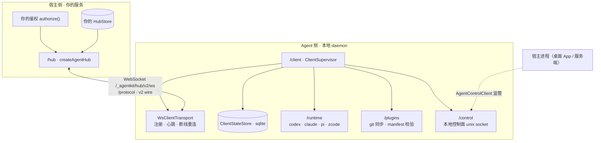

# allinai-agentkit

独立持久 **Agent Client**：连接 Hub，可靠执行本地平台 Agent（Codex / Claude / Pi，可选）与受策略门控的能力，并向上游回报状态。本仓库 = npm 包 `@allin-ai/agentkit`（协议 / hub / client / console）+ CLI `allinai-agentkit` + 官方 Next.js 控制台 `@allin-ai/agentkit-web`（自托管 UI 的参考实现）。

官网（介绍与使用场景）：https://df007df.github.io/allinai-agentkit/ ，由 `site/` 目录经 GitHub Actions 自动发布。完整文档（安装 → CLI 参考 → 功能 → 系统集成 → 架构）：https://df007df.github.io/allinai-agentkit/docs.html

## 快速开始（npm）

要求 Node.js ≥ 22.18。包已发布到 npm，无需克隆仓库：

```bash
# Console 需要 @allin-ai/agentkit-web（官方 Next.js 控制台）
npm i -g @allin-ai/agentkit @allin-ai/agentkit-web

# 终端 A：启动 Console（Hub + web UI 同进程；默认 http://127.0.0.1:4317）
allinai-agentkit web

# 终端 B：浏览器授权接入，然后常驻接入
allinai-agentkit login --hub http://127.0.0.1:4317
allinai-agentkit daemon
```

## 快速开始（本地源码）

```bash
pnpm install && pnpm build

# 终端 A：启动 Console（Hub + web UI 同进程；默认 http://127.0.0.1:4317）
# @allin-ai/agentkit-web 是本仓库的 workspace devDep，pnpm install 已链接
node bin/allinai-agentkit web

# 终端 B：浏览器授权接入
node bin/allinai-agentkit login --hub http://127.0.0.1:4317

# 终端 B：常驻接入
node bin/allinai-agentkit daemon
```

打开 http://127.0.0.1:4317 ：控制台会出现你的 client，可派发任务并观察协议事件时间线。

授权模型：Console 启动不发放任何全局 token；client 凭自己 config 里的唯一 clientId 发起 `login`，浏览器授权页确认后，Console 内存中登记 `token → clientId` 并以此放行后续连接（内存态，重启即清空，需重新 login）。

## 安装（一键 sh 脚本）

```bash
sh scripts/install.sh                 # npm 全局安装最新版
sh scripts/install.sh 0.3.2           # 指定版本
sh scripts/install.sh --from-source   # 本仓库构建 + npm link（开发）
```

脚本会检查 Node.js ≥ 22.18，安装后验证 `allinai-agentkit --help`。

## 架构与包结构



支撑模块（daemon 内部使用）：`/config` 工作目录与本地策略、`/credentials` token 存取（0600 文件，全平台一致）、`/paths` 数据目录、`/logger` 滚动日志、`/service/*` 开机自启。开发与联调：`/hub/testkit` 内存 Hub；`/console` Console 服务端胶水（路由 / SSE 观察 / 授权桥），`/console-ui` React 组件。

## 两个包

| 包 | 内容 |
|---|---|
| `@allin-ai/agentkit`（core） | 协议（`/protocol`）、Hub（`/hub`）、Client（`/client`）、Console 服务端胶水（`/console`）、Console React 组件（`/console-ui`），以及 config / credentials / control / logger 等设施与 CLI |
| `@allin-ai/agentkit-web` | 官方 Next.js 控制台（自定义 server 把 Hub 与 Console UI 跑在同一进程），自托管 UI 的参考实现；`allinai-agentkit web` 依赖它 |

| 入口 | 分组 | 内容 |
|---|---|---|
| `@allin-ai/agentkit` | 入口 | 公共 API 汇总（protocol / hub / client 核心、config、credentials、control、logger、paths；不含 runtime、testkit、console） |
| `@allin-ai/agentkit/protocol` | 协议 | v2 wire 协议与全部编解码；`/wire` 为兼容别名 |
| `@allin-ai/agentkit/hub` | Hub 侧 | `createAgentHub({ authorize, store })`，HubStore 六方法端口，`offer()` 派发 |
| `@allin-ai/agentkit/hub/testkit` | Hub 侧 | `MemoryHubStore` / `createMemoryHub`，易失实现（勿用于生产） |
| `@allin-ai/agentkit/client` | Agent 侧 | `ClientSupervisor` + `WsClientTransport` + `ClientStateStore`（sqlite 落盘） |
| `@allin-ai/agentkit/runtime` | Agent 侧 | `createRunnerManager` 与 codex / claude / pi / zcode 适配（可选 peer） |
| `@allin-ai/agentkit/plugins` | Agent 侧 | `PluginManager`：plugin.sync → git 同步 + manifest 校验 |
| `@allin-ai/agentkit/control` | Agent 侧 | 本地控制面（unix socket）：health / status / approve / plugins |
| `@allin-ai/agentkit/config` | 设施 | clientId、本地策略、projects 工作目录（`~/.allinai/agent/config.json`） |
| `@allin-ai/agentkit/credentials` | 设施 | token 存取：每 clientId 一个 0600 文件，全平台一致 |
| `@allin-ai/agentkit/paths` | 设施 | 数据目录与 socket 端点解析 |
| `@allin-ai/agentkit/logger` | 设施 | 滚动 JSONL 日志，原文写盘不脱敏 |
| `@allin-ai/agentkit/service/launchd` | 设施 | macOS 用户级服务注册 |
| `@allin-ai/agentkit/service/systemd` | 设施 | Linux 用户级服务注册 |
| `@allin-ai/agentkit/cli` | 工具 | 全部 CLI 子命令实现（bin 的薄封装在其上） |
| `@allin-ai/agentkit/console` | 工具 | Console 服务端胶水：`startConsoleServer()`、TokenRegistry、SSE 观察流、静态资源处理 |
| `@allin-ai/agentkit/console-ui` | 工具 | Console React 组件（`ConsoleApp` 等）与 SSE 事件接入，`@allin-ai/agentkit-web` 基于它构建 |

## CLI

```
allinai-agentkit <init|login|daemon|web|install|status|logs|sync|restart|uninstall|doctor|projects|project|plugins|docs>
allinai-agentkit project --name web --path /work/web    # 注册项目工作目录
allinai-agentkit project --name web --remove            # 移除
allinai-agentkit projects                               # 列出已注册项目
allinai-agentkit plugins [--refresh]                    # 查看已装插件；--refresh 重新上报 Hub
allinai-agentkit plugins --action install --git-url URL --id ID   # 本地登记插件
allinai-agentkit docs [--json]                          # 输出完整 CLI 使用手册（Markdown；--json 为结构化输出，适合 AI agent 读取）
```

### 项目目录

项目在 client 本地 config.json 的 `projects` 中注册（`project add` 即写入，同时生成持久化的会话记录后缀 `dir`）。Hub 下发的 `agent.run` 可携带 `payload.project`：

- 不带 `project`（或名字未注册）：cwd 落在 `~/.allinai/agent/projects/default/runtime/<平台>/<executionId>/`（一次性 scratch，可按需清理），会话记录在 `~/.allinai/agent/projects/default/sessions/<executionId>/`；
- 带 `project` 且已注册：cwd 就是注册的目录本身，会话记录在 `~/.allinai/agent/projects/<名称>-<dir>/sessions/<executionId>/`（`events.jsonl` 状态时间线 + `session.json` 终态摘要），不会写进项目目录本身。

Hub 无法自选任意路径——只能从本地注册的目录里按名字挑选。运行中的 daemon 会在下一条 `agent.run` 时重读项目注册（无需重启）。项目名单随 `inventory.report` 上报（仅名字），Console 的发起执行表单据此渲染项目下拉。

### 插件（技能载体）

插件 = 一个 Git 仓库 = 一组技能 + 平台入口清单，是技能的唯一载体（详细机制见[官网插件专页](https://df007df.github.io/allinai-agentkit/plugins.html)）：

- **登记制**：中心经 Console 登记（`plugin.sync` 下发期望清单），或本地 `plugins --action install --git-url URL --id ID` 登记机器自有插件；两者互不覆盖（Hub 全量推送不移除本地登记）。
- **单仓 checkout**：`plugins/<id>/repo/` 唯一常驻 clone，更新 = fetch + checkout，untracked 临时文件天然存活；tracked 改动或本地领先 commit → `diverged` 拒绝自动更新，Console 两按钮人工裁决（强制覆盖 / 保留本地）。
- **多平台自动分发**：同步成功后按「期望平台 ∩ 本机已装」分发——codex marketplace 安装（版本钉死）、pi `pi install`（实时引用）、claude 运行时 `--plugin-dir` 直连；分发状态随 inventory 上报、Console 徽章可见。
- **内置 agentkit-system 插件**：daemon 启动物化（免登记），提供 client-control 技能（教 agent 操作宿主）与三平台 ask-user hooks（高危工具先过本地审批桥 → Hub 人工确认；插件作用域，不做用户级安装）。
- **完全授权执行**：claude `--permission-mode bypassPermissions`、codex `-s danger-full-access --ask-for-approval never`——门禁由自有审批层承担，平台层不拦。

### 执行日志

daemon 把每条命令的接收、策略判定、runner 终态写入 `~/.allinai/agent/logs/agent.log`（滚动 JSONL，原文写盘不脱敏）。`allinai-agentkit logs [-f]` 原样查看与跟随。

## 开发

```bash
pnpm typecheck && pnpm test && pnpm build && pnpm verify:artifact
```

## 发布

推送 `v*` 标签触发 `.github/workflows/release.yml`：测试 → 类型检查 → `verify:artifact` → 经 trusted publishing 发布到 npm（附 SLSA provenance，无需本地凭据）。

```bash
# 本例：发布 0.3.3
npm version patch          # 或手改 package.json 的 version
git push --follow-tags
```

MIT License.
