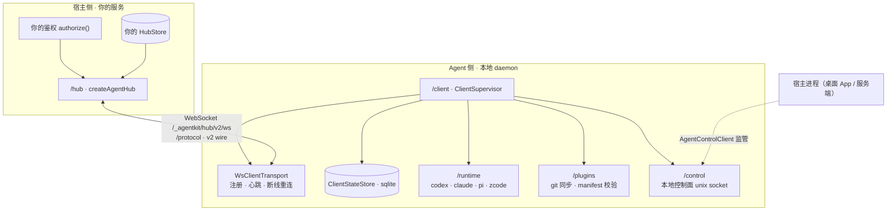

# allinai-agentkit

同仓库维护两个独立 npm 包：`@allin-ai/agentkit-hub` 为业务系统提供 Hub SDK 和可单独启动的 Next.js 控制台；`@allin-ai/agentkit-client` 在执行机器上运行持久 Client，连接 Hub、执行本地平台 Agent 和受策略门控的能力，再回报状态。

两个包没有相互的生产依赖。协议、路由、路径和公共配置类型使用同一份内部源码，构建时分别编入两个包；不发布第三个共享包。

官网（介绍与使用场景）：https://df007df.github.io/allinai-agentkit/ ，由 `site/` 目录经 GitHub Actions 自动发布。完整文档（安装 → CLI 参考 → 功能 → 系统集成 → 架构）：https://df007df.github.io/allinai-agentkit/docs.html

## 快速开始（npm）

要求 Node.js ≥ 22.18。以下为双包发布后的安装方式（源码开发见下一节）：

```bash
# 在 Hub 机器上安装控制台；在执行机器上安装 Client，可分别安装
npm i -g @allin-ai/agentkit-client @allin-ai/agentkit-hub

# 终端 A：启动 Console（Hub + web UI 同进程；默认 http://127.0.0.1:4317）
allinai-agentkit-hub web

# 终端 B：浏览器授权接入，然后常驻接入
allinai-agentkit login --hub http://127.0.0.1:4317
allinai-agentkit daemon
```

## 快速开始（本地源码）

```bash
pnpm install && pnpm build

# 终端 A：启动 Console（Hub + web UI 同进程；默认 http://127.0.0.1:4317）
node bin/allinai-agentkit-hub web

# 终端 B：浏览器授权接入
node bin/allinai-agentkit login --hub http://127.0.0.1:4317

# 终端 B：常驻接入
node bin/allinai-agentkit daemon
```

打开 http://127.0.0.1:4317 ：控制台会出现你的 client，可派发任务并观察协议事件时间线。

授权模型：Console 启动不发放任何全局 token；client 凭自己 config 里的唯一 clientId 发起 `login`，浏览器授权页确认后，Console 登记 `token → clientId` 并以此放行后续连接。官方控制台把 token 与 Issues 数据分别保存到 `tokens.db`、`issues.db`，重启后仍可使用；嵌入式 Console 可自行选择存储。

## 安装（一键 sh 脚本）

```bash
sh scripts/install.sh                 # npm 全局安装最新版
sh scripts/install.sh 0.5.0           # 指定版本
sh scripts/install.sh --from-source   # 本仓库构建 + npm link（开发）
```

脚本会检查 Node.js ≥ 22.18，安装后验证 `allinai-agentkit --help`。

## 架构与包结构


```mermaid
flowchart TB
    subgraph host["宿主侧 · 你的服务"]
        auth["你的鉴权 authorize()"]
        db[("你的 HubStore")]
        hub["/hub · createAgentHub"]
        auth --> hub
        db --> hub
    end

    subgraph agent["Agent 侧 · 本地 daemon"]
        sup["/client · ClientSupervisor"]
        ws["WsClientTransport<br/>注册 · 心跳 · 断线重连"]
        state[("ClientStateStore · sqlite")]
        rt["/runtime<br/>codex · claude · pi · zcode"]
        pl["/plugins<br/>git 同步 · manifest 校验"]
        ctl["/control<br/>本地控制面 unix socket"]
        sup --> ws
        sup --> state
        sup --> rt
        sup --> pl
        sup --> ctl
    end

    hub <-->|"WebSocket /_agentkit/hub/v2/ws<br/>/protocol · v2 wire"| ws
    you["宿主进程（桌面 App / 服务端）"] -.->|"AgentControlClient 监管"| ctl
```

支撑模块（daemon 内部使用）：`/config` 工作目录与本地策略、`/credentials` token 存取（0600 文件，全平台一致）、`/paths` 数据目录、`/logger` 滚动日志、`/service/*` 开机自启。开发与联调：`/hub/testkit` 内存 Hub；`/console` Console 服务端胶水（路由 / SSE 观察 / 授权桥），`/console-ui` React 组件。

## 包和源码结构

| 包 | 内容 | 命令 |
|---|---|---|
| `@allin-ai/agentkit-hub` | Hub SDK、testkit、Console、Issues 服务端、React UI、预构建 Next.js 控制台 | `allinai-agentkit-hub web` |
| `@allin-ai/agentkit-client` | Client、runtime、plugins、本地控制面、配置、凭据、开机自启、CLI | `allinai-agentkit daemon` |

```text
packages/
  hub/src/       Hub SDK、Console、Issues 与 Hub CLI
  hub/web/       官方 Next.js 控制台源码
  client/src/    Client、执行器、插件与 Client CLI
  shared/src/    内部共享源码，不是 npm 包
```

Hub 主入口仅导出 SDK 与协议，不加载 Console、Next.js 或 React。官方 Web UI 通过 `/web` 或 Hub CLI 启动。Client 安装不包含 React、Next.js 或 Hub；平台 Agent 仍需按原有方式在本机安装。

| 入口 | 内容 |
|---|---|
| `@allin-ai/agentkit-hub` 或 `/hub` | `createAgentHub`、HubStore 等接口 |
| `@allin-ai/agentkit-hub/hub/testkit` | 易失的 `MemoryHubStore`、`createMemoryHub` |
| `@allin-ai/agentkit-hub/console` | Console runtime、路由、观察流、授权桥 |
| `@allin-ai/agentkit-hub/console-ui` | React 控制台组件，样式在 `/console-ui/styles.css` |
| `@allin-ai/agentkit-hub/web` | `startWebHost`，启动预构建控制台 |
| `@allin-ai/agentkit-hub/issues` | Issues 数据与服务端 API |
| `@allin-ai/agentkit-hub/agent-api` | Hub REST API 路由接口 |
| `@allin-ai/agentkit-client` 或 `/client` | ClientSupervisor、WsClientTransport、ClientStateStore |
| `@allin-ai/agentkit-client/runtime` | 平台执行适配和 RunnerManager |
| `@allin-ai/agentkit-client/plugins` | 本地插件管理与分发 |
| `@allin-ai/agentkit-client/control` | 本地控制面 |
| `@allin-ai/agentkit-client/config`、`/credentials`、`/service/*`、`/cli` | Client 配置、凭据、服务与 CLI |
| 两包各自的 `/protocol`、`/wire`、`/routes`、`/paths`、`/logger` | 相同来源的公共协议与设施 |

业务系统嵌入 Hub：

```ts
import { createAgentHub } from "@allin-ai/agentkit-hub";
const hub = createAgentHub({ authorize, store });
hub.attach(httpServer);
```

从旧包迁移：Hub/Console/Issues 的导入改为 `@allin-ai/agentkit-hub/...`，本地 Client 的导入改为 `@allin-ai/agentkit-client/...`。`allinai-agentkit web` 改为 `allinai-agentkit-hub web`；其他 Client 命令与数据目录保持原样。原 `agentkit-web` 已并入 Hub 包。

全局安装迁移时，先卸载旧 npm 包，再安装新包，避免两个包争用 `allinai-agentkit` 命令：

```bash
npm uninstall -g @allin-ai/agentkit @allin-ai/agentkit-web
npm install -g @allin-ai/agentkit-client @allin-ai/agentkit-hub
```

## CLI

```
allinai-agentkit <init|login|daemon|install|status|logs|sync|restart|uninstall|doctor|projects|project|plugins|docs>
allinai-agentkit project --name web --path /work/web    # 注册项目工作目录
allinai-agentkit project --name web --remove            # 移除
allinai-agentkit projects                               # 列出已注册项目
allinai-agentkit plugins [--refresh]                    # 查看已装插件；--refresh 重新上报 Hub
allinai-agentkit plugins --action install --git-url URL --id ID   # 本地登记插件
allinai-agentkit docs [--json]                          # 输出完整 CLI 使用手册（Markdown；--json 为结构化输出，适合 AI agent 读取）
```

### 项目目录

项目在 client 本地 config.json 的 `projects` 中注册（`project add` 即写入，同时生成持久化的会话记录后缀 `dir`）。Hub 下发的 `agent.run` 可携带 `payload.project`：

- 不带 `project`（或名字未注册）：cwd 落在 `~/.allinai/agent/projects/default/runtime/<平台>/<executionId>/`（一次性 scratch，可按需清理），会话记录在 `~/.allinai/agent/projects/default/sessions/<executionId>/`；
- 带 `project` 且已注册：cwd 就是注册的目录本身，会话记录在 `~/.allinai/agent/projects/<名称>-<dir>/sessions/<executionId>/`（`events.jsonl` 状态时间线 + `session.json` 终态摘要），不会写进项目目录本身。

Hub 无法自选任意路径——只能从本地注册的目录里按名字挑选。运行中的 daemon 会在下一条 `agent.run` 时重读项目注册（无需重启）。项目名单随 `inventory.report` 上报（仅名字），Console 的发起执行表单据此渲染项目下拉。

### 插件（技能载体）

插件 = 一个 Git 仓库 = 一组技能 + 平台入口清单，是技能的唯一载体（详细机制见[官网插件专页](https://df007df.github.io/allinai-agentkit/plugins.html)）：

- **登记制**：中心经 Console 登记（`plugin.sync` 下发期望清单），或本地 `plugins --action install --git-url URL --id ID` 登记机器自有插件；两者互不覆盖（Hub 全量推送不移除本地登记）。
- **单仓 checkout**：`plugins/<id>/repo/` 唯一常驻 clone，更新 = fetch + checkout，untracked 临时文件天然存活；tracked 改动或本地领先 commit → `diverged` 拒绝自动更新，Console 两按钮人工裁决（强制覆盖 / 保留本地）。
- **多平台自动分发**：同步成功后按「期望平台 ∩ 本机已装」分发——codex marketplace 安装（版本钉死）、pi `pi install`（实时引用）、claude 运行时 `--plugin-dir` 直连；分发状态随 inventory 上报、Console 徽章可见。
- **内置 agentkit-system 插件**：daemon 启动物化（免登记），提供 client-control 技能（教 agent 操作宿主）与三平台 tool ask-user hooks（在平台需要人工确认工具执行时上报本地审批桥 → Hub 人工决策，未拒绝即放行；插件作用域，不做用户级安装）。
- **完全授权执行**：codex `-s danger-full-access`（实测该沙箱策略不影响 hooks 触发；0.156+ 的 `codex exec` 已无 `--ask-for-approval` 旗子）；claude 跑默认权限模式，由 PermissionRequest 钩子对每次询问显式回 allow（实测 bypassPermissions 会压掉该钩子，ask-user 上报随之失效）——效果等同放权，同时保住 ask-user 时刻的上报。
- **两段式审批闭环**：hook 先向审批桥注册拿到 requestId，再挂等人工决定；Console 的 deny/allow 经 `respond_tool_approval` 原路到达挂起的 hook，人工拒绝才真正拦截。

### 执行日志

daemon 把每条命令的接收、策略判定、runner 终态写入 `~/.allinai/agent/logs/agent.log`（滚动 JSONL，原文写盘不脱敏）。`allinai-agentkit logs [-f]` 原样查看与跟随。

## 开发

```bash
pnpm typecheck
pnpm test
pnpm verify:artifact  # 构建并验证两个 tarball（含真实登录与 WebSocket 互联）
pnpm test:web         # 构建后验证 Next.js host
# npm registry 不可用时，以当前锁定版本的 pnpm 缓存依赖校验同样的 npm tarball：
pnpm verify:artifact:offline
```

## 发布

两个包使用同一版本号。同步更新根 `package.json`、`packages/hub/package.json`、`packages/client/package.json` 的 version，再推送相同版本的 `v*` 标签。Release workflow 运行测试、类型检查、双包产物验证和 Web host 测试后，分别发布 `.publish-stage/hub` 与 `.publish-stage/client`，附 npm provenance。

两个新包均需在 npm 配置此仓库 `.github/workflows/release.yml` 的 trusted publisher。本地验证不会发布到 npm。

MIT License.
