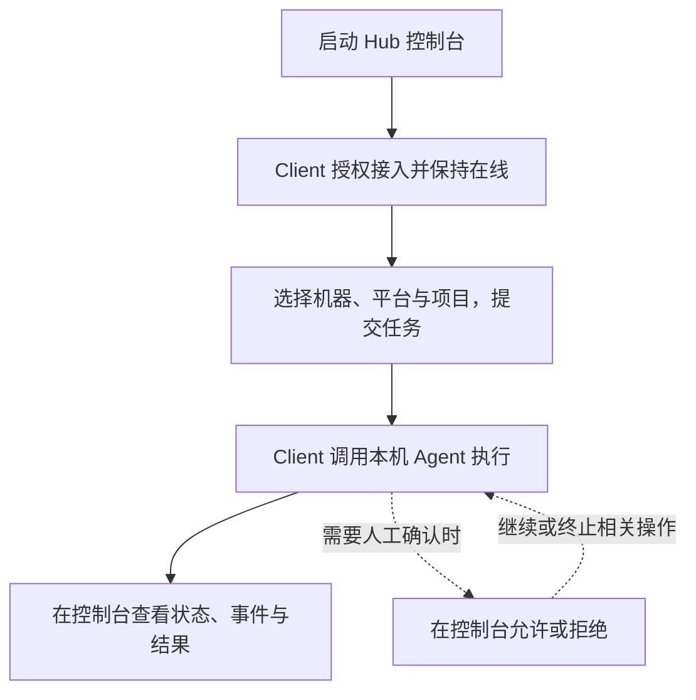

# allinai-agentkit

allinai-agentkit 用来连接业务系统与本地 AI Agent，让你从一个入口派发任务，在指定机器上调用 Codex、Claude、Pi 或 zcode 执行，并集中查看运行状态、执行过程和结果。

它适合需要把 AI Agent 接入现有产品、内部工具或日常开发流程的场景：例如，从管理台让开发机检查一个代码项目，通过 Issue 安排 Agent 排查问题，或向多台执行机器分发统一的技能插件。

项目由两个角色组成：**Hub** 是任务派发和管理入口，可以直接启动 Web 控制台，也可以作为 SDK 嵌入你的应用；**Client** 常驻在执行机器上，连接 Hub，调用本机已安装的平台 Agent，并回传执行信息。

当前版本：**0.6.0** · [官网](https://df007df.github.io/allinai-agentkit/) · [完整文档](https://df007df.github.io/allinai-agentkit/docs.html) · [变更记录](CHANGELOG.md)

## 主要功能

### 1. 连接执行机器，统一派发多平台任务

**使用场景：** 你的内部平台、桌面应用或管理台需要发起代码修改、问题排查、文档整理等任务，并指定由哪台机器、哪种 Agent 执行。

**解决问题：** 不同 Agent 有不同的启动方式；业务系统还需要处理执行机器接入、任务传递和状态回传。每接入一个平台，都重复建设这些流程会增加维护成本。

**提供方案：** 由 Hub 管理接入的 Client，通过同一个任务入口选择执行机器和平台，Client 负责调用对应的本机 Agent。

- 支持 Codex、Claude、Pi 和 zcode，沿用各平台在执行机器上的安装与账号配置。
- Client 上报可用平台和已注册项目，控制台据此提供执行选项。
- 可以直接使用自带的 Web 控制台派发任务，也可以通过 Hub SDK 接入自己的业务流程。

例如，管理台提交“检查 web 项目的登录逻辑”，选择开发机、Codex 和 `web` 项目后，由该机器上的 Codex 处理。

### 2. 常驻运行与连接恢复

**使用场景：** 执行机器需要持续接收任务，网络偶尔中断，或者你希望登录电脑后 Client 自动启动。

**解决问题：** 手工启动命令难以维持长期连接；连接断开后，中心容易丢失执行进度，重复投递也可能导致同一条任务被再次启动。

**提供方案：** Client 以常驻进程运行，维护连接和本地执行状态，连接恢复后补报尚未确认的事件。

- 自动注册、发送心跳、断线重连，让 Hub 持续了解机器的在线状态。
- 本地保存执行状态与待上报事件，对重复命令进行去重。
- 可限制同时执行的任务数量，默认一次执行一个任务。
- 支持注册为 macOS 或 Linux 用户级服务，在登录后自动启动；提供状态查询、重启、日志和自检命令。

连接恢复负责恢复通信和事件上报；正在执行的 Agent 会话如何恢复，取决于对应平台的能力。

### 3. 集中观察执行过程，保留排查依据

**使用场景：** 任务已经发出，你需要判断它是否开始、当前在做什么、是否等待人工确认，以及最终成功还是失败。

**解决问题：** 只看到“任务已提交”不足以判断执行情况；去每台机器翻终端输出，也难以把任务、平台会话和本地日志对应起来。

**提供方案：** Web 控制台集中展示 Client 状态和执行事件，Client 为每次执行保留独立的会话记录。

- 实时查看 Client 的在线状态、可用平台、项目和插件信息。
- 在执行列表与详情中查看状态变化、事件时间线，以及平台提供的会话标识。
- 在同一个控制台处理待审批事项，并继续观察后续执行状态。
- 本地保存会话事件、终态摘要和运行日志，方便按同一次执行排查问题。

官方控制台持久保存授权凭据与 Issues；执行事件的长期保存方式可在嵌入 Hub 时通过存储接口自行实现。

### 4. 按项目选择工作目录

**使用场景：** 一台机器上有多个代码仓库，希望任务进入正确的项目目录；临时任务则需要独立的工作空间。

**解决问题：** 仅传一段提示词，Agent 未必知道应操作哪个项目。把工作目录和会话记录混在一起，也会让项目文件与运行记录难以管理。

**提供方案：** 在 Client 本地登记项目名称与目录，派发任务时按名称选择项目。

- 已登记项目在其真实目录中执行，适合检查代码、修改文件、运行项目命令。
- 未选择已登记项目时，使用按执行划分的临时目录，适合一次性任务。
- 会话记录保存在 Client 的数据目录中，与项目文件分开管理。
- 项目清单同步到控制台；本地新增或修改项目后，下一次任务即可读取新配置。

例如，在执行机器上登记 `web` 和 `api` 两个项目，控制台发起任务时即可选择对应项目。Hub 按项目名称选择本地登记的目录。

### 5. 统一管理插件与技能

**使用场景：** 一组技能需要分发给多台机器，或同时提供给 Codex、Claude、Pi 使用；部分机器还需要保留自己的插件。

**解决问题：** 手工复制技能容易造成版本不一致；更新时还可能覆盖本地修改，或者无法判断插件是否已成功安装到目标平台。

**提供方案：** 以 Git 仓库承载插件与技能，由 Hub 或 Client 登记，Client 同步后按插件声明和本机平台进行分发。

- Hub 管理统一的插件清单，Client 也可以登记机器自有插件，两类登记分别维护。
- 一个插件可以包含多个技能与平台入口，支持向已安装的 Codex、Claude、Pi 分发。
- 控制台展示插件同步与平台分发状态，便于发现安装失败或版本差异。
- 支持检查更新、指定版本与回退；遇到受版本控制的本地修改或领先提交时，暂停自动更新，由人选择覆盖或保留。
- 内置系统插件提供 Client 操作说明、Issues 操作指引，以及支持平台的工具确认接入。

插件结构、各平台分发方式和冲突处理见[插件专页](https://df007df.github.io/allinai-agentkit/plugins.html)。

### 6. 接入授权、本地策略与人工审批

**使用场景：** 新执行机器接入 Hub 时需要确认身份；部分任务希望先审批，再启动；Agent 执行中提出确认请求时，需要人参与决定。

**解决问题：** 机器接入、任务启动审批和运行中的工具确认属于不同环节，需要分别管理，并让人的决定能够回到执行端。

**提供方案：** Client 通过浏览器授权接入，运行前应用本地策略，支持的平台工具确认请求通过审批桥交给控制台处理。

- 每个 Client 使用自己的身份与授权凭据，登录时在浏览器确认接入。
- 本地可配置任务启动审批与插件来源规则，按执行机器分别维护。
- 可开启任务启动前审批，控制台允许后才开始执行；默认配置为自动启动任务。
- 对接入审批桥的 Codex、Claude、Pi 工具确认请求，可在控制台选择允许或拒绝，决定回传给等待中的请求。

### 7. 用 Issues 组织人与 Agent 的协作

**使用场景：** 一个问题需要先描述背景，再分配、讨论、执行和跟踪，例如让 Agent 排查缺陷，再由人确认结论与下一步。

**解决问题：** 单次提示词缺少持续的工作记录，讨论内容、执行过程和处理状态容易散落在不同位置，后续很难知道谁在处理、做到哪一步。

**提供方案：** 内置 Issues，把问题描述、评论、状态与关联执行放在一起，并支持在评论中通过 `@Agent` 发起处理。

- 创建 Issue，维护标题、背景、优先级、负责人和处理状态。
- 通过评论与回复补充事实、讨论方案，收件箱汇集分配、提及和状态变化等通知。
- 在评论中提及已接入的 Agent，系统结合 Issue 内容和近期评论派发任务。
- 为 Agent 提供读取 Issue、回复评论、更新状态的 CLI，让它能按任务要求把结论写回工作记录。
- 同一 Issue 中同一 Agent 的执行尚未结束时，新的提及先合并等待；若 Issue 仍在处理中，本次执行成功结束后再处理后续内容。

例如，创建“登录后页面空白”，补充复现步骤并 `@开发机` 请求排查；Agent 收到带背景的任务，可读取完整讨论、回复发现并更新状态，人再据此继续确认。使用步骤见 [Issues 协作](https://df007df.github.io/allinai-agentkit/docs.html#quickstart-issues)。

## 一次任务怎样完成


```mermaid
flowchart TB
    hub["启动 Hub 控制台"] --> client["Client 授权接入并保持在线"]
    client --> task["选择机器、平台与项目，提交任务"]
    task --> run["Client 调用本机 Agent 执行"]
    run --> result["在控制台查看状态、事件与结果"]
    run -.->|"需要人工确认时"| approval["在控制台允许或拒绝"]
    approval -.->|"继续或终止相关操作"| run
```

## 快速开始

准备 Node.js ≥ 22.18，并在执行机器上安装、登录至少一个支持的平台 Agent。使用 Git 插件时还需要 Git。

### 1. 启动 Hub 控制台

```bash
npm install -g @allin-ai/agentkit-hub
allinai-agentkit-hub web
```

打开 [本机控制台](http://127.0.0.1:4317)，作为任务派发和管理入口。Hub 与 Client 可以运行在同一台机器，也可以分开部署；跨机器连接时使用 Client 能访问到的 Hub 地址。网络部署与应用集成见[完整文档](https://df007df.github.io/allinai-agentkit/docs.html#integration)。

### 2. 在执行机器上安装并授权 Client

在另一个终端执行：

```bash
npm install -g @allin-ai/agentkit-client
allinai-agentkit login --hub http://127.0.0.1:4317
```

`login` 打开浏览器授权页面，确认后保存该 Client 的凭据。

### 3. 登记项目、启动 Client 并发起任务

如果要操作现有代码项目，先在执行机器上登记目录，将示例路径替换成真实的绝对路径：

```bash
allinai-agentkit project --name web --path /absolute/path/to/your-project
allinai-agentkit projects
```

然后启动 Client：

```bash
allinai-agentkit daemon
```

保持这个终端运行，控制台随后会显示该 Client、可用平台和项目。选择在线 Client、执行平台和 `web` 项目，输入任务，例如“检查登录流程，说明可能的问题和修改建议”，提交后即可观察执行进度。也可以跳过项目登记，先用独立临时目录体验一次任务。

## 按部署角色安装

| 你的用途 | 安装的包 | 使用方式 |
|---|---|---|
| 直接使用任务控制台 | `@allin-ai/agentkit-hub` | 运行 `allinai-agentkit-hub web` |
| 把任务派发接入现有应用 | `@allin-ai/agentkit-hub` | 在应用中使用 Hub SDK，接入自己的鉴权与存储 |
| 让一台机器接收并执行任务 | `@allin-ai/agentkit-client` | 授权后运行 `allinai-agentkit daemon` |

两个 npm 包分别安装，平台 Agent 沿用本机已有的安装。SDK 接入示例见[宿主服务集成](https://df007df.github.io/allinai-agentkit/docs.html#integration-hub)；桌面应用管理本地 Client 的方式见[本地控制接口](https://df007df.github.io/allinai-agentkit/docs.html#integration-control)。

<details>
<summary>从旧包迁移</summary>

先卸载旧包，再安装新包：

```bash
npm uninstall -g @allin-ai/agentkit @allin-ai/agentkit-web
npm install -g @allin-ai/agentkit-client @allin-ai/agentkit-hub
```

Hub、Console、Issues 的导入改为 `@allin-ai/agentkit-hub/...`，本地 Client 的导入改为 `@allin-ai/agentkit-client/...`。启动控制台的命令改为 `allinai-agentkit-hub web`，原 `agentkit-web` 已并入 Hub 包。其他 Client 命令与数据目录保持原样，详见[迁移说明](https://df007df.github.io/allinai-agentkit/docs.html#install-migrate)。

</details>

## 常用操作与文档

| 操作 | Client 命令 |
|---|---|
| 检查运行状态 | `allinai-agentkit status` |
| 跟随运行日志 | `allinai-agentkit logs -f` |
| 检查平台与环境 | `allinai-agentkit doctor` |
| 登录后自动启动 | `allinai-agentkit install` |
| 重启后台服务 | `allinai-agentkit restart` |
| 查看插件并重新上报 | `allinai-agentkit plugins --refresh` |
| 查看 Issues | `allinai-agentkit issue list` |
| 查看完整 CLI 手册 | `allinai-agentkit docs` |

更多内容：

- [安装与 CLI](https://df007df.github.io/allinai-agentkit/docs.html#cli)：命令、参数、配置和服务管理。
- [项目与执行平台](https://df007df.github.io/allinai-agentkit/docs.html#features-projects)：工作目录、运行方式和平台要求。
- [插件与技能](https://df007df.github.io/allinai-agentkit/plugins.html)：插件结构、登记、分发与版本管理。
- [应用集成](https://df007df.github.io/allinai-agentkit/docs.html#integration)：Hub SDK、Next.js、Console 与本地 Client 管理。
- [架构与模块](https://df007df.github.io/allinai-agentkit/docs.html#architecture)：协议、事件、存储和包入口。
- [故障排查](https://df007df.github.io/allinai-agentkit/docs.html#troubleshooting)：连接、授权、执行和插件问题。

## 源码开发与发布

<details>
<summary>查看开发命令、源码结构与维护者发布流程</summary>

### 本地启动

```bash
pnpm install
pnpm build

# 终端 A：启动控制台
node bin/allinai-agentkit-hub web

# 终端 B：授权后常驻运行
node bin/allinai-agentkit login --hub http://127.0.0.1:4317
node bin/allinai-agentkit daemon
```

也可以使用仓库安装脚本：`sh scripts/install.sh` 安装最新版 Client，`sh scripts/install.sh 0.6.0` 安装指定版本，`sh scripts/install.sh --from-source` 构建并链接本地 Client。Hub 控制台另行安装。

### 源码结构

```text
packages/
  hub/src/       Hub SDK、Console、Issues 与 Hub CLI
  hub/web/       官方 Next.js 控制台源码
  client/src/    Client、执行器、插件与 Client CLI
  shared/src/    内部共享源码，不单独发布 npm 包
```

Hub 与 Client 没有相互的生产依赖；公共协议与配置类型来自内部共享源码，分别编入两个包。Hub 主入口提供 SDK 与协议，Web 控制台通过 `/web` 或 Hub CLI 启动。

### 验证

```bash
pnpm typecheck
pnpm test
pnpm verify:artifact  # 构建并验证两个 tarball，含登录与 WebSocket 互联
pnpm test:web         # 构建后验证 Next.js host
pnpm verify:artifact:offline  # 使用当前锁定版本的缓存依赖校验 tarball
```

### 发布 npm 包与 Pages

两个包使用同一版本号。同步更新根 `package.json`、`packages/hub/package.json`、`packages/client/package.json` 的 version、CHANGELOG 与网站文档，再推送相同版本的 `v*` 标签。Release workflow 完成测试、类型检查、双包产物与 Web host 验证后，通过 npm trusted publishing 发布两个包，附 npm provenance。

首次发布新包时，需先在已登录的维护者机器上提交代码并验证产物，再发布并配置 trusted publisher：

```bash
pnpm verify:artifact
pnpm test:web
node scripts/publish-stage.mjs publish-staged
npm trust github @allin-ai/agentkit-hub --repo df007df/allinai-agentkit --file release.yml --allow-publish --yes
npm trust github @allin-ai/agentkit-client --repo df007df/allinai-agentkit --file release.yml --allow-publish --yes
```

新包须先存在于 npm，才能配置 trusted publisher；配置时需要维护者的双因素认证。首次本地发布没有 CI provenance，后续由 GitHub Actions 发布。重试发布时，脚本只跳过 `gitHead` 与当前提交一致的已发布版本；其他提交占用版本或 registry 查询失败都会终止。验证命令本身不会发布。

Pages 承载静态介绍与文档，Hub 控制台通过 Hub 包启动。`site/` 变更合入 `main` 后自动部署，也可手动运行 `pages.yml`。

</details>

## License

MIT License.
